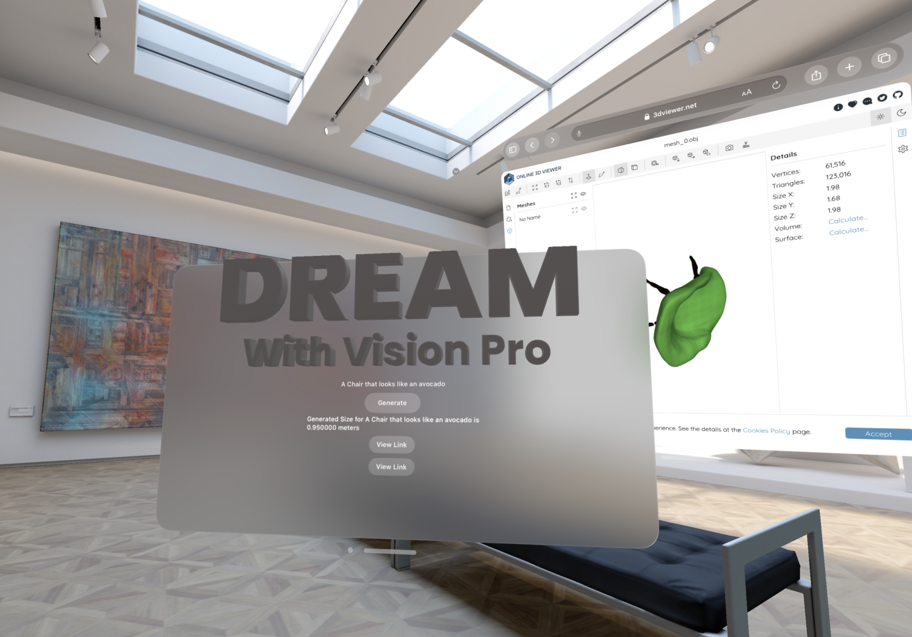
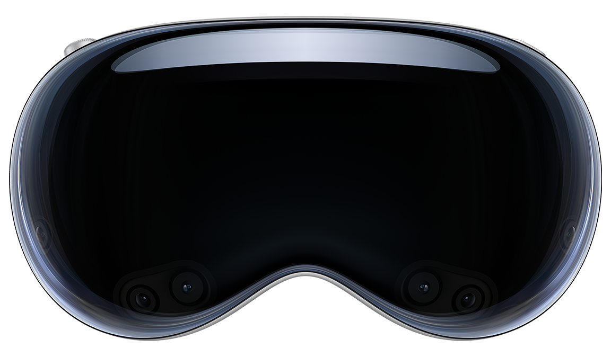
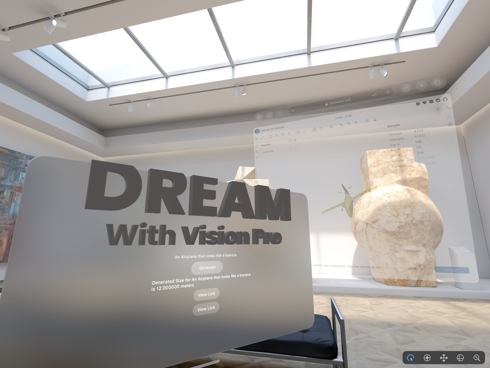

# Dream with Vision Pro

[](https://discord.gg/C6ukDBEbFY)

Welcome to Dream with Vision Pro, a lucid text-to-3D tool built with the Apple VisionOS SDK. Powered by Scale AI's Spellbook, OpenAI's GPT-4 and Shap-E, Modal, Replicate, and the Meta Quest 2, we empower you to transform your imagination into stunning immersive experiences.



##  Enter Your Vision:

Type in the text description of the object you envision. This could be anything from an elephant to a sword. Unleash your imagination. Once you've described it, your object will appear before you.

## Demo



Using Scale AI's Spellbound to infer the size of the objects to render accurately. 


## How it Works

Here's a step-by-step breakdown of what Dream with Vision Pro does:

First, the user specifies the object they want to visualize. This input triggers the [Shap-E](https://github.com/openai/shap-e) model via [Modal](https://mcantillon21--dream-fastapi-app.modal.run/) and Replicate, producing a .obj file - a standard 3D model format.

Next, we employ [Spellbook](https://dashboard.scale.com/spellbook/api/v2/deploy/9f33d7g) and GPT-4 to estimate the object's height, ensuring the 3D representation is accurately scaled.

The final phase employs [3D Viewer](https://3dviewer.net) to convert your .obj file into a realistic 3D model that you can interact with. This 3D model can be directly accessed from your Meta Quest 2, offering a fully immersive experience of your original concept.

## Spellbook Prompts

### System:

```
As an AI system, you are extremely skilled at extracting objects and estimating their realistic height in meters from a given text prompt. Your task is to identify the object(s) mentioned in the prompt and their estimated height in meters. Once identified, the information must be formatted according to the provided format for a text-to-3D model application.
```

### User:

```
Could you extract the object and realistic object height in meters from the following text prompts?

Begin:

Input: a red apple
Output: 0.075

Input: a large elephant
Output: 3.000


Input: {{ input }}
Output:
```

## Next Steps

We've started to integrate OpenAI's Whisper model, expanding our capability beyond text-to-3D transformations. Users will be able to engage in a more intuitive way, interacting with their 3D creations through the power of voice.

Once we have the .obj file, we are working on using [USZD Tools](https://developer.apple.com/augmented-reality/tools/) which lets us convert to the .usdz format - a requisite for VisionOS. Following this conversion, we can seamlessly render the objects.

## Acknowledgements

We thank the Scale AI Spellbook team for the credits and ease of use, Ben Firshman of Replicate for the dedicated A100 GPU we run Shap-E on, Erik Bernhardsson of Modal for the dedicated Whisper and hosted endpoints, and especially Mehran Jalali for letting us borrow the Meta Quest 2 for testing.
